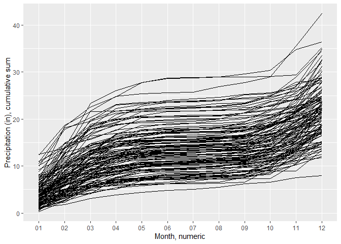
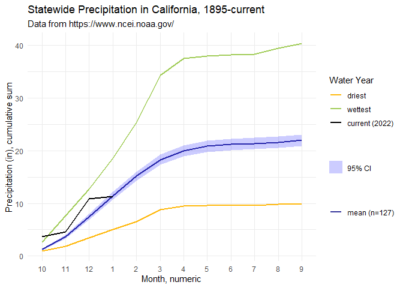

California Precipitation Visualizations
================
Corey Clatterbuck
2022-07-08

This is an [R Markdown](http://rmarkdown.rstudio.com) file with
github_document as the yaml output. When you execute code within the
.Rmd, the results appear beneath the code. I knit the .Rmd to a .md file
so that the file renders appropriately in the GitHub repo.

## Load & reformat

First we load packages, the raw data, and re-format the data.

``` r
library(here)
library(tidyverse)
library(janitor)
library(scales)

dataset <- read_csv(here("data", "4-pcp-all-1-1895-2022.csv"), skip = 4, show_col_types = FALSE)
dataset$Date <- format(lubridate::parse_date_time(dataset$Date, orders = c("ym")), "%m-%Y") 

dataset <- as.data.frame(dataset)
```

The columns loaded are:

-   Date (in month and year)

-   Value (precipitation in inches)

-   Anomaly (departure from mean, relative to month, 1981-2010)

Changes to metadata past the start date should be available from the
[NOAA
website](https://www.ncei.noaa.gov/access/monitoring/climate-at-a-glance/statewide/time-series/4/pcp/all/1/1895-2022?base_prd=true&begbaseyear=1981&endbaseyear=2010)
where the data were sourced.

## Let’s play

### Calendar year

First, we create a data set that has the month and year separated to
make plotting easier. We then calculate the cumulative sum of
precipitation over the calendar year (csum_cyear) and plot the time
series.

``` r
chunk2 <- dataset %>% 
  separate(Date, c("Month", "Year")) %>%
  group_by(Year) %>%
  mutate(csum_cyear = cumsum(Value))

ggplot(chunk2, aes(x = Month, y = csum_cyear)) +
  geom_line(aes(group = Year), colour = "black") +
  labs(x = "Month, numeric", y = "Precipitation (in), cumulative sum")
```

<!-- -->

Note this option doesn’t provide a legend as the default, but it is a
start.

### Water year

What if we wanted to plot the water year instead? We need to make two
primary changes to the data: Ensure the water year starts in the correct
month (October) and re-calculate the cumulative precipitation over the
water year.

The flow of the code below is as follows:

-   Separate month & year into separate columns

-   Mutate all character columns into numeric columns (you wouldn’t want
    to do this if your character columns did not consist entirely of
    numbers, as the result would contains cells with NA.)

-   Create the water year based on calendar month & create the water
    month as a factor starting with October

-   Rearrange the dataset so the earliest row by water year & water
    month is first

-   Calculate the cumulative precipitation over the water year

``` r
chunk3 <- dataset %>% 
  separate(Date, c("Month", "Year")) %>%
  mutate_if(is.character,as.numeric) %>%
  mutate(WaterYear = case_when(
    Month >= 10 ~ Year + 1,
    TRUE ~ Year),
    WaterMonth = fct_relevel(as.factor(Month), c('10', '11', '12',
                                                 '1', '2', '3',
                                                 '4', '5', '6',
                                                 '7', '8', '9'))
  ) %>%
  arrange(WaterYear, WaterMonth) %>%
  group_by(WaterYear) %>%
  mutate(csum_wyear = cumsum(Value)) %>%
  ungroup()

str(chunk3)
```

    ## tibble [1,525 × 7] (S3: tbl_df/tbl/data.frame)
    ##  $ Month     : num [1:1525] 1 2 3 4 5 6 7 8 9 10 ...
    ##  $ Year      : num [1:1525] 1895 1895 1895 1895 1895 ...
    ##  $ Value     : num [1:1525] 9.25 2.56 2.52 1.25 1.41 0.04 0.14 0.16 0.92 0.49 ...
    ##  $ Anomaly   : num [1:1525] 5.18 -1.4 -0.81 -0.41 0.45 -0.3 -0.04 -0.07 0.5 -0.78 ...
    ##  $ WaterYear : num [1:1525] 1895 1895 1895 1895 1895 ...
    ##  $ WaterMonth: Factor w/ 12 levels "10","11","12",..: 4 5 6 7 8 9 10 11 12 1 ...
    ##  $ csum_wyear: num [1:1525] 9.25 11.81 14.33 15.58 16.99 ...

``` r
ggplot(chunk3, aes(x = WaterMonth, y = csum_wyear)) +
  geom_line(aes(group = WaterYear), colour = "black") +
  labs(x = "Month, numeric", y = "Precipitation (in), cumulative sum")
```

<!-- -->

### Additional requested edits

I won’t go through all of the suggested changes from our Teams chat (see
the ReadMe for details), but I will add some of the suggested changes,
including:

-   calculate & plot the mean & 95% confidence interval (assuming normal
    distribution)

-   highlight the current year

-   citing data sources

-   labeling the x-axis (already completed in above chunks)

We’ll do this within the water year. I still need to futz more with the
legend appearance re: mean & confidence interval, but I think this is
decent.

``` r
colnames(chunk3)
```

    ## [1] "Month"      "Year"       "Value"      "Anomaly"    "WaterYear" 
    ## [6] "WaterMonth" "csum_wyear"

``` r
## calculate mean & 95% CI over all years
CIs <- chunk3 %>%
  group_by(WaterMonth) %>%
  summarise(mean.precip = mean(csum_wyear, na.rm = TRUE),
            sd.precip = sd(csum_wyear, na.rm = TRUE),
            n.precip = n()) %>%
  mutate(se.precip = sd.precip / sqrt(n.precip),
         lower.ci.precip = mean.precip - qt(1 - (0.05 / 2), n.precip - 1) * se.precip,
         upper.ci.precip = mean.precip + qt(1 - (0.05 / 2), n.precip - 1) * se.precip) %>%
  dplyr::select(WaterMonth, mean.precip, lower.ci.precip, upper.ci.precip)

Means <- CIs %>% ## make separate df to aid binding columns
  dplyr::select(WaterMonth, mean.precip) %>%
  mutate(WaterYear = "mean") %>%
  relocate(WaterYear) %>%
  rename(csum_wyear = mean.precip)


## find the current year, wettest year, driest year. 
chunk3 %>%
  dplyr::filter(WaterMonth == "9") %>% ## find driest & wettest
  arrange(csum_wyear) %>%
  slice(c(1,n()))
```

    ## # A tibble: 2 × 7
    ##   Month  Year Value Anomaly WaterYear WaterMonth csum_wyear
    ##   <dbl> <dbl> <dbl>   <dbl>     <dbl> <fct>           <dbl>
    ## 1     9  1924  0.14   -0.28      1924 9                9.94
    ## 2     9  1983  0.91    0.49      1983 9               40.4

``` r
## subset the years above & bind the mean data
years_needed <- chunk3 %>%
  dplyr::filter(WaterYear == 1924 |
                  WaterYear == 1983 |
                  WaterYear == 2022) %>%
  dplyr::select(WaterYear, WaterMonth, csum_wyear) %>%
  mutate(WaterYear = as.character(WaterYear)) %>%
  bind_rows(., Means)


## add nice colors for plot
mycols <- c("#E69512", "#3A5D3D", "#D3105C", "#4C4976") ## from palette "superbloom3", github.com/an-bui/calecopal
# show_col(mycols) ## Uncomment & run to view a grid of the above colors


## plot
try1 <- ggplot() +
  geom_line(data=years_needed, aes(x=WaterMonth, y=csum_wyear, group = WaterYear, color = as.factor(WaterYear)), size = 2) +
  scale_color_manual("Water Year",
                     values = mycols,
                     labels = c("driest (1924)", "wettest (1983)", "current (2022)", paste("mean ", " 95% CI", sep = "\u00B1"))) +
  labs(x = "Month, numeric", 
       y = "Precipitation (in), cumulative sum",
       title = "Statewide Precipitation in California, 1895-current",
       subtitle = "Data from https://www.ncei.noaa.gov/",
       color = NULL) +
  theme_minimal()

try1 + geom_ribbon(data = CIs, aes(x = WaterMonth, ymin=lower.ci.precip, ymax=upper.ci.precip, fill = "CI", group = 1), alpha = 0.3) +
  scale_fill_manual(name = "Test",
                    values = c("CI" = "#6C91BD"),
                    guide = "none")
```

<!-- -->
