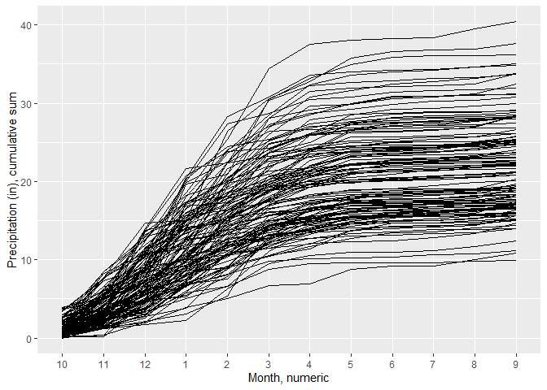

California Precipitation Visualizations
================
Corey Clatterbuck
2022-07-01

This is an [R Markdown](http://rmarkdown.rstudio.com) Notebook. When you
execute code within the notebook, the results appear beneath the code.

## Load & reformat

First we load packages, the raw data, and re-format the data.

``` r
library(here)
library(tidyverse)
library(janitor)

dataset <- read_csv(here("data", "4-pcp-all-1-1895-2022.csv"), skip = 4, show_col_types = FALSE)
dataset$Date <- format(lubridate::parse_date_time(dataset$Date, orders = c("ym")), "%m-%Y") 

dataset <- as.data.frame(dataset)
```

The columns loaded are:

-   Date (in month and year)

-   Value (precipitation in inches)

-   Anomaly (departure from mean, relative to month, 1981-2010)

Changes to metadata past the start date should be available from the
[NOAA
website](https://www.ncei.noaa.gov/access/monitoring/climate-at-a-glance/statewide/time-series/4/pcp/all/1/1895-2022?base_prd=true&begbaseyear=1981&endbaseyear=2010)
where the data were sourced.

## Let’s play

### Calendar year

First, we create a data set that has the month and year separated to
make plotting easier. We then calculate the cumulative sum of
precipitation over the calendar year (csum_cyear) and plot the time
series.

``` r
chunk2 <- dataset %>% 
  separate(Date, c("Month", "Year")) %>%
  group_by(Year) %>%
  mutate(csum_cyear = cumsum(Value))

ggplot(chunk2, aes(x = Month, y = csum_cyear)) +
  geom_line(aes(group = Year), colour = "black") +
  labs(x = "Month, numeric", y = "Precipitation (in), cumulative sum")
```

<!-- -->

Note this option doesn’t provide a legend as the default, but it is a
start.

### Water year

What if we wanted to plot the water year instead? We need to make two
primary changes to the data: Ensure the water year starts in the correct
month (October) and re-calculate the cumulative precipitation over the
water year.

The flow of the code below is as follows:

-   Separate month & year into separate columns

-   Mutate all character columns into numeric columns (you wouldn’t want
    to do this if your character columns did not consist entirely of
    numbers, as the result would contains cells with NA.)

-   Create the water year based on calendar month & create the water
    month as a factor starting with October

-   Rearrange the dataset so the earliest row by water year & water
    month is first

-   Calculate the cumulative precipitation over the water year

``` r
chunk3 <- dataset %>% 
  separate(Date, c("Month", "Year")) %>%
  mutate_if(is.character,as.numeric) %>%
  mutate(WaterYear = case_when(
    Month >= 10 ~ Year + 1,
    TRUE ~ Year),
    WaterMonth = fct_relevel(as.factor(Month), c('10', '11', '12',
                                                 '1', '2', '3',
                                                 '4', '5', '6',
                                                 '7', '8', '9'))
  ) %>%
  arrange(WaterYear, WaterMonth) %>%
  group_by(WaterYear) %>%
  mutate(csum_wyear = cumsum(Value)) %>%
  ungroup()

str(chunk3)
```

    ## tibble [1,525 × 7] (S3: tbl_df/tbl/data.frame)
    ##  $ Month     : num [1:1525] 1 2 3 4 5 6 7 8 9 10 ...
    ##  $ Year      : num [1:1525] 1895 1895 1895 1895 1895 ...
    ##  $ Value     : num [1:1525] 9.25 2.56 2.52 1.25 1.41 0.04 0.14 0.16 0.92 0.49 ...
    ##  $ Anomaly   : num [1:1525] 5.18 -1.4 -0.81 -0.41 0.45 -0.3 -0.04 -0.07 0.5 -0.78 ...
    ##  $ WaterYear : num [1:1525] 1895 1895 1895 1895 1895 ...
    ##  $ WaterMonth: Factor w/ 12 levels "10","11","12",..: 4 5 6 7 8 9 10 11 12 1 ...
    ##  $ csum_wyear: num [1:1525] 9.25 11.81 14.33 15.58 16.99 ...

``` r
ggplot(chunk3, aes(x = WaterMonth, y = csum_wyear)) +
  geom_line(aes(group = WaterYear), colour = "black") +
  labs(x = "Month, numeric", y = "Precipitation (in), cumulative sum")
```

<!-- -->
